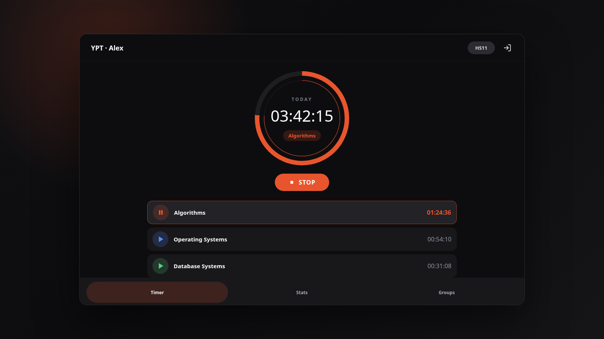

# YPT Desktop Client

열품타(YPT)를 데스크톱에서 쓰기 위한 **비공식 Flutter 클라이언트**입니다.
데스크톱 앱, Flutter 웹 데모, Next.js 랜딩 페이지를 함께 포함합니다.

[English README](README_en.md)



## 중요 안내

- 이 프로젝트는 **비공식**이며 YPT, Pallo Inc. 또는 관련 권리자와 제휴,
  후원, 승인 관계가 없습니다.
- 본인 계정으로 사용하는 개인 연동 용도만 의도했습니다. 타인 계정 조작,
  자동화 악용, 공부 시간 조작은 의도된 사용이 아닙니다.
- 클라이언트는 `pi.tgclab.com`의 문서화되지 않은 HTTPS API와 통신합니다.
  예고 없이 동작이 바뀔 수 있고, 서비스 약관과 충돌할 수 있습니다.
- 이메일과 비밀번호는 YPT 로그인 요청에 사용됩니다. 로그인 JWT는
  `shared_preferences`를 통해 로컬에 저장됩니다.
- Also, I used Codex (GPT 5.5) for the document part, and got some advice from Claude AI on APK reverse engineering.

## 주요 기능

- 이메일 로그인과 로컬 JWT 자동 로그인
- 과목별 공부 타이머 시작/정지
- 오늘 공부 시간, 과목별 누적 시간, 카테고리 랭킹 조회
- 참여 중인 그룹, 둘러보기 그룹, 그룹 멤버 공부 현황 조회
- Linux, Windows, macOS 데스크톱 빌드 타깃
- 랜딩 페이지의 `/demo/` 경로에 연결되는 Flutter 웹 빌드

## 다운로드

사전 빌드된 데스크톱 파일은
[GitHub Releases](https://github.com/deveworld/ypt_client/releases)에
첨부됩니다.

- Linux x64 `.tar.gz` 및 `.sha256`
- Windows x64 `.zip` 및 `.sha256`
- macOS x64 `.zip` 및 `.sha256`

현재 워크플로는 Flutter 빌드 산출물을 패키징합니다. 별도의 코드 서명이나
notarization 단계는 없습니다.

## 소스에서 빌드

Linux 데스크톱 개발 빌드:

```bash
flutter doctor
flutter pub get
flutter run -d linux
```

Linux 릴리스 빌드:

```bash
flutter build linux --release
```

Linux 실행 번들은 아래 경로에 생성됩니다.

```text
build/linux/x64/release/bundle/
```

데스크톱 앱은 대상 OS와 같은 호스트에서 빌드하는 것이 기본입니다. 여러 OS용
릴리스 파일은 아래 GitHub Actions 워크플로를 사용합니다.

## 웹 데모와 랜딩 페이지

프로젝트에는 두 가지 웹 표면이 있습니다.

- `web/`: Flutter 웹 데모 타깃
- `landing/`: 정적 Next.js 랜딩 페이지

랜딩 페이지 로컬 실행:

```bash
cd landing
npm ci
npm run dev
```

정적 랜딩 빌드:

```bash
cd landing
npm run build
```

Flutter 웹 데모 수동 빌드:

```bash
flutter pub get
flutter build web --release --base-href /demo/
```

GitHub Pages 워크플로는 두 웹 표면을 모두 빌드한 뒤 `build/web/`을
`landing/out/demo/`에 복사하고, `landing/out/`을 배포합니다.

## GitHub Actions

### Pages 배포

`.github/workflows/deploy-web.yml`은 `main` 브랜치에서 아래 영역이 바뀔 때
실행됩니다.

- `landing/**`
- `web/**`
- `lib/**`
- `pubspec.yaml`
- `pubspec.lock`
- 배포 워크플로 자체

프로젝트 Pages 저장소에서는 Next.js base path로 `/<repo>`를 사용하고,
Flutter 웹 base href로 `/<repo>/demo/`를 사용합니다. `*.github.io`
저장소에서는 도메인 루트와 `/demo/`를 사용합니다.

### 데스크톱 릴리스 파일

`.github/workflows/release-desktop.yml`은 수동 `workflow_dispatch`
워크플로입니다. 기존 GitHub Release 태그를 입력하면 OS별 GitHub Actions
runner에서 빌드하고 아래 파일을 업로드합니다.

- Linux x64 `.tar.gz` 및 `.sha256`
- Windows x64 `.zip` 및 `.sha256`
- macOS x64 `.zip` 및 `.sha256`

Flutter 데스크톱은 Linux 호스트에 별도 컴파일러만 설치해서 Windows/macOS 앱을
만드는 방식의 cross build를 지원하지 않습니다.

## 프로젝트 구조

```text
lib/                       Flutter 앱 소스
  app_state.dart           인증, 타이머, 통계, 그룹 상태
  ypt_api.dart             YPT API 클라이언트
  models.dart              API 응답 모델
  screens/                 로그인, 홈, 타이머, 통계, 그룹 화면

linux/                     Flutter Linux 데스크톱 타깃
macos/                     Flutter macOS 데스크톱 타깃
windows/                   Flutter Windows 데스크톱 타깃
web/                       Flutter 웹 데모 타깃
landing/                   Next.js 정적 랜딩 페이지
.github/workflows/         Pages 배포 및 데스크톱 릴리스 워크플로
```

## 개발 체크리스트

- 문서화되지 않은 API 동작은 `lib/ypt_api.dart`에 최대한 격리합니다.
- API 필드명이나 값 타입이 바뀔 수 있으므로 응답 파싱은 방어적으로 유지합니다.
- Flutter SDK가 있는 환경에서는 Flutter 변경 전 `flutter analyze`를 실행합니다.
- 랜딩 페이지 변경 전 `landing/`에서 `npm run build`를 실행합니다.
- 웹 데모 변경 전 `flutter build web --release --base-href /demo/`를 실행합니다.

## 라이선스

[MIT](LICENSE)
